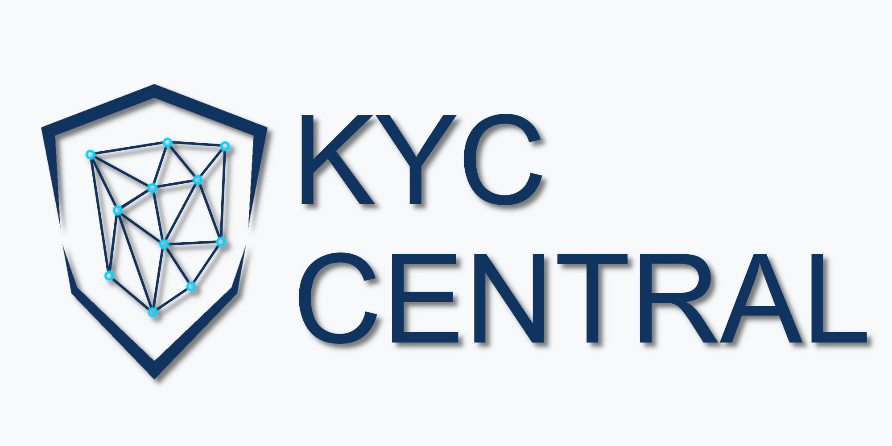

  

# KYC Central Ltd

We build **KYC Central**, a UK company due diligence platform.

## What we do

If you've ever had to run Know Your Customer or Customer Due Diligence checks on a UK company, you already know the shape of this problem. It looks like fifteen browser tabs.

One tab for Companies House, to check the company is active and its filings aren't overdue. Another for the officer list — and then one more tab *per officer* to check for disqualifications. A tab for the OFAC SDN list. Another for the UN Security Council list. Another for the UK FCDO list. Another for the EU Financial Sanctions Files. A tab for the FCA Register if they're regulated. A search for the beneficial owners. A news search for each name that comes up, hoping you spot anything relevant. The ICIJ Offshore Leaks database if you're being thorough.

Then you copy the findings into a document, timestamp it, and file it.

The data was never the hard part. **All of it is public.** The hard part is that it's scattered across a dozen registers with a dozen different interfaces, none of which talk to each other, and none of which tell you what any of it *means* in combination.

KYC Central closes that gap. It takes a company name — or just its registration number — and screens it across Companies House, the four major sanctions regimes, the FCA Register, GLEIF, the Insolvency Service, the ICIJ Offshore Leaks database, and adverse media. In seconds. In one place.

You pick a rule set, you click Run, and the flags come back sorted by severity — each one explaining what triggered it and why it matters. Fifty-plus built-in rules cover company status, officer history, beneficial ownership, filing compliance, insolvency, sanctions, sector authorisation, offshore exposure, and adverse media. When you're done, the whole assessment exports as a PDF report, ready to file.

## What you get

- **Preview any UK company** on the homepage — no account needed
- **Free account** — ten full assessments a month with the complete rule engine, not a crippled demo
- **Professional** — unlimited assessments, adverse media, the AI features, custom rules, team workspaces, PDF export, and API access
- **Enterprise** — for larger teams
- **Single PDF** — one report on one company, without creating an account at all

Live prices are always on [the pricing page](https://kyccentral.co.uk/pricing).

## What we don't do

A few things you won't see from us, and why:

- **No PEP screening.** Not until we have a genuine, properly sourced PEP dataset behind it. We'd rather ship nothing than ship a check that looks authoritative and isn't.
- **No continuous monitoring.** Assessments run on demand. There is no watchlist, and no alert when a company's status changes.
- **UK companies only.** GLEIF lets us resolve parent chains across borders; that is not the same as screening a foreign company.
- **No "all clear".** If a data source is unavailable, the checks that depend on it return *nothing* — not a reassuring green tick. A missing check never looks like a passed check.
- **It does not replace a compliance review.** KYC Central surfaces signals worth investigating and gathers the evidence. **The judgement stays yours.**

## Get started

[Run your first assessment](https://kyccentral.co.uk/dashboard) — or just [search a company](https://kyccentral.co.uk) and see what the data says.

---

   
  KYC Central Ltd · Company No. 17405668 · Registered office: 71-75 Shelton Street, Covent Garden, London, WC2H 9JQ, United Kingdom

